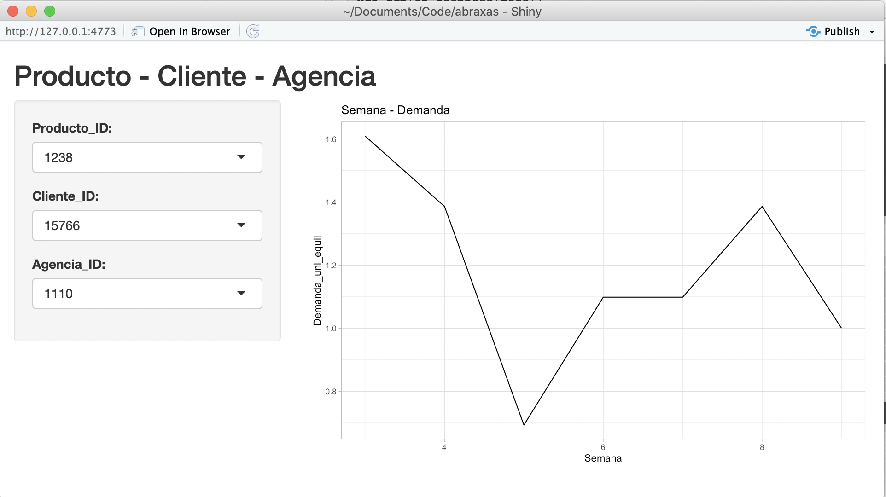

# Bimbo Demand Forecasting

Forecast of the week 9 given a client, product and agency.

## Reproducibility instructions
  - Install packrat dependencies with `packrat::restore()`
  - Add abraxas datasets to `./data` directory (Not included in repo)
  - Knit Rmd at `./vignettes/case_study.Rmd` to train the model and copmpute forecast
  - Once forecast is computed, run shiny app at `./app.R`
  - ENJOY!
